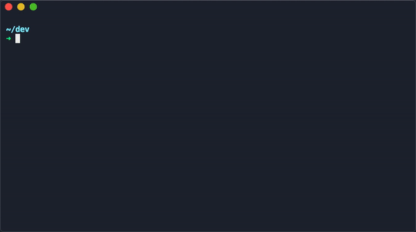

# golf ⛳️

> the faster way to init a project



## requirements

- bash 4+
- dialog
- jq

macOS users can install all with homebrew

```bash
$ brew install bash dialog jq
```

## installation

**homebrew -- not working atm**

```bash
$ brew tap gretzky/formulae
$ brew install golf
```

**manually**

```bash
$ git clone https://github.com/gretzky/golf
$ make install
```

by default, it installs to `/usr/local`. you can change the prefix if you want.

```bash
$ make PREFIX=$WHATEVER install
```

you can also uninstall with `make uninstall`

## usage

```bash
$ golf
```

by default, golf creates your project directory and outputs a gitignore, editorconfig, license, readme, and optional github templates all based on your input.

**options**

`-d | --with-defaults`: will output a generic gitignore, editorconfig, README, and the MIT license

`-m | --minimal`: outputs only a gitignore and editorconfig

for help, run golf with the `-h | --help` flag, or `man golf`.

# license

[MIT](./LICENSE)
